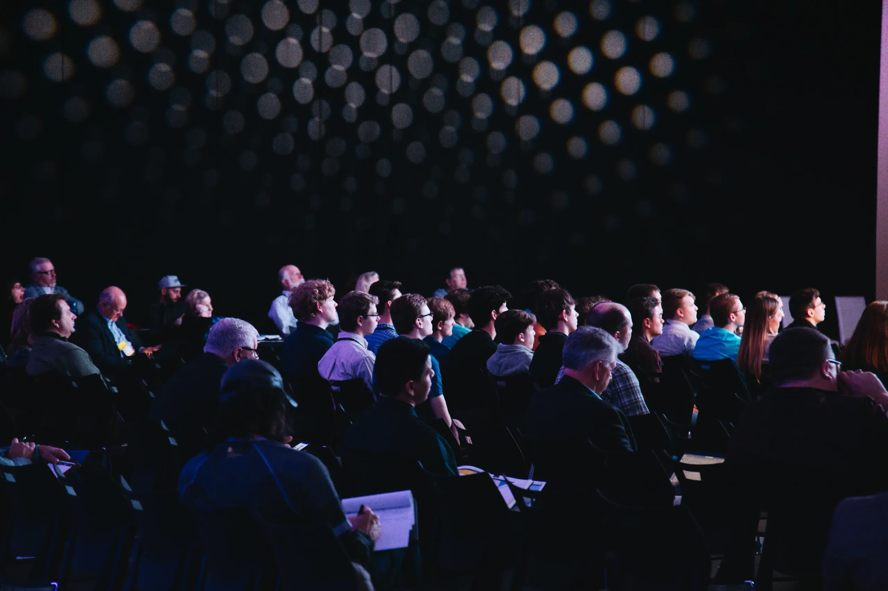
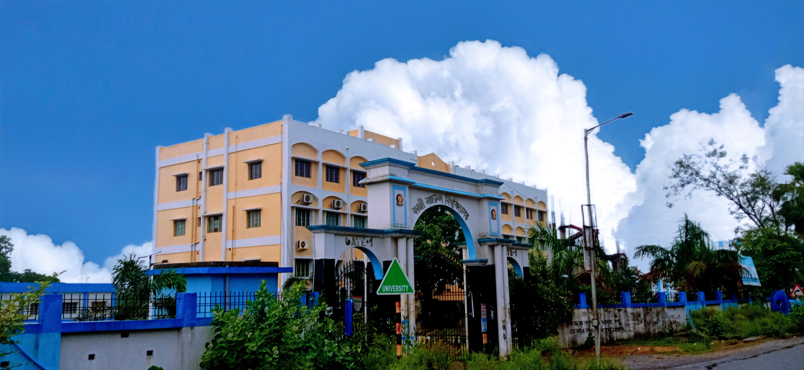
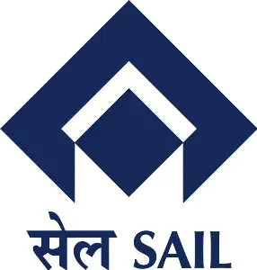

## Hero Section

### Conference Title: `International Conference on Processing of Minerals, Metals and Materials: Beyond Tomorrow`

### Organizing authority: `Organized by Department of Metallurgical Engineering, Kazi Nazrul University, Asansol, India In Association with National Institute of Technology, Durgapur, India and National Metallurgical Laboratory, Jamshedpur, India`

### Dates: `21 to 23rd February, 2024`

### Venue: `Fairfield by Marriot, Kolkata, West Bengal, India`

## Quick Intro about the conference

- Welcome to the International Conference on Processing of Minerals, Metals, and Materials - Kolkata 2023! Join us for this esteemed event organized by Kazi Nazrul University Metallurgy Engineering Department, where researchers, industry experts, and professionals converge to explore the latest advancements in metallurgy engineering and the processing of minerals, metals, and materials. Don't miss the opportunity to showcase your research papers, network with global experts, and be part of shaping the future of this field. Register now and secure your place at this premier conference.

- 

## About University and Deaprtment

- Kazi Nazrul University (KNU), a nascent university in the heart of industrial belt in West Bengal, runs on
  its campus and also in its affiliated colleges Diploma, UG, PG, M Phil and Ph.D. courses in the Faculty of
  Arts and fine Arts, Faculty of Science & Technology, Faculty of Law and Faculty of Commerce &
  Management. It caters to the need of more than forty four thousand students every year. Within eight years
  of its existence, KNU has put a mark in academia by way of imparting knowledge, developing skills,
  promoting entrepreneurship among students for making them competent as per needs of the society from
  the local to the global in various fields including research. Various initiatives have already been taken to
  internationalize the University for connecting it globally with institutions of repute. As an academic
  institution KNU believes in four I's Inspiration, Innovation, Inculcation and Integration.

  The Department of Metallurgical Engineering in the School of Mines and Metallurgy, KNU, started offering
  three years diploma in Metallurgical Engineering from 2017. The Department has started offering B. Tech.
  in Metallurgical and Materials Engineering from 2019 onwards. Both the Diploma and Degree courses are
  approved by AICTE. The Department has its own Board of Studies (BOS) with experts from eminent
  institutes, e.g. IITs and NITs. Besides teaching, faculty members are also engaged in collaborative research
  with various academic and research institutes, and industries. Students undertake vocational training,
  internship, and research projects in various reputed organizations like IISCO, Tata Hitachi, NML, RINL,
  and nearby iron and steel plants.

  

## Special Attraction

We would like to come forward to help with Dokra Metal Craft which is situated in Bikna
village in Bankura. We want that people take more of it in future and not to push their
traditional heritage towards extinction. We have seen that most of the people in Bikna village
depend on this for their livelihood and both of their sales and profit margins have decreased a
lot. So, It should be the moral responsibility of every human being to preserve the heritage.

- Insert Dokra Metal Craft Image

## Souvenir

During ICPMMM2024, a souvenir will be released by the Chief Patron on 20th March, 2024. The Souvenir will contain messages from
Govt.functionaries and Eminent professionals, special articles, ATM event details, details about various committees, awards,
sponsors/supporters and advertisements from various industries, organizations from India and abroad. The soft copy of the souvenir will be provided to all the delegates attending the event.Limited high qualityhard copies will be printed for distribution to Govt. agencies, Industries, R&D labs and Academic Institutions.

## Registration Fees

- Delegates are requested to register and pay online. Registration fees
  can be paid by electronic fund transfer or through Demand Draft in
  favour of “ICPMMM2024” payable at Kolkata

| Category             | INR  | USD |
| :------------------- | :--- | :-- |
| Academics            | 8000 | 450 |
| Industry and R&D lab | 9000 | 600 |
| Students             | 4000 | 300 |
| Accompany/Spouse     | 4000 | 300 |

## Sponsors

- 

## Venue Location and Contact details

- Venue

  - Name: Fairfield by Marriot, Kolkata
  - Address: Cb 218, CB Block(Newtown), Action Area 1C, Newtown, Kolkata, West Bengal 700156

- Contact
  - Conference Chairman: Prof. Projjal Basu
  - KAZI NAZRUL UNIVERSITY,
    Asansol-713340, West Bengal,
    India
  - Mobile: +91 7406409273
  - Email: icpmmm2024@gmail.com /
    metallurgy.projjal@knu.ac.in

## Page visitor counter

## Footer section
